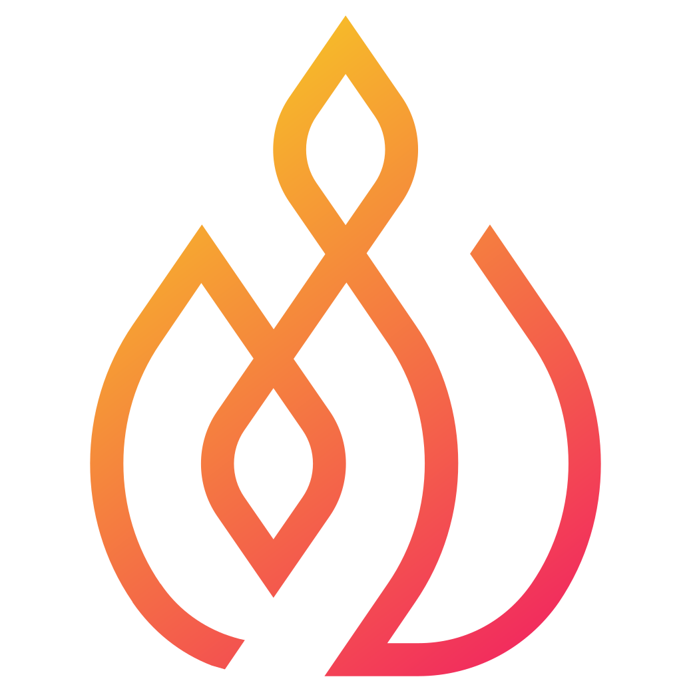

# Howdy! I'm Derek 👋

I'm a software engineer passionate about solving complex problems, creating innovative solutions, and empowering others through collaboration. I leverage a music education background by mixing a detail-oriented approach with a bit of artistic flair to drive impactful results for any team.

When not at the computer, you can typically find me outside riding a bike. Racing season is upon us! 🚴🏻‍♂️

## What's new?

Currently, I'm building [Vispyr](https://vispyr.com), an open-source, easy to install observability tool that brings continuous profiling to small development teams by combining profiles with traditional telemetry data to provide code-level insights into an application’s performance.

  
  

## Check out my Tech-Proficiencies

## Let's get to know each other

Feel free to reach out to me on [Linkedin](https://www.linkedin.com/in/derek-novak-2754a3289/) or shoot me an email at derek.novak1@gmail.com
